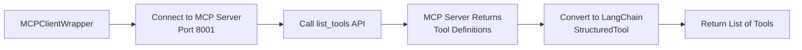
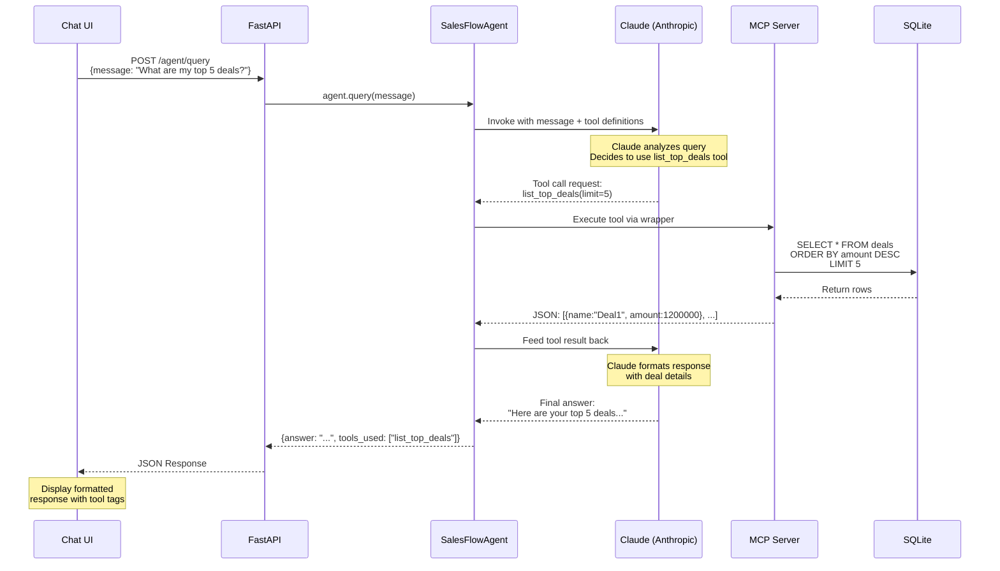

# SalesFlow Agent - Complete Architecture & Flow Documentation

## 📋 Table of Contents
1. [Application Entry Point](#application-entry-point)
2. [Startup Sequence](#startup-sequence)
3. [Tool Discovery & Registration](#tool-discovery--registration)
4. [Agent Initialization](#agent-initialization)
5. [Chat UI Flow](#chat-ui-flow)
6. [Complete Request-Response Flow](#complete-request-response-flow)
7. [Key Components](#key-components)

---

## 🚀 Application Entry Point

### Starting Point: `salesflow_agent/__main__.py`

**When you run:** `python -m salesflow_agent` or `uv run python -m salesflow_agent`

This triggers the `__main__.py` file, which is the **true entry point** of the application.

```python
# Entry flow:
1. Load environment variables (.env)
2. Validate ANTHROPIC_API_KEY exists
3. Start MCP server as subprocess
4. Seed database
5. Start FastAPI application (imports main.py)
```

---

## 🔄 Startup Sequence (Step-by-Step)

```mermaid
graph TD
    A[python -m salesflow_agent] --> B[__main__.py: main()]
    B --> C[Load .env file]
    C --> D[Start MCP Server Subprocess<br/>Port 8001]
    D --> E[Wait 5 seconds for MCP startup]
    E --> F[Seed SQLite database]
    F --> G[Start FastAPI with uvicorn<br/>Port 8000]
    G --> H[main.py: lifespan startup]
    H --> I[Tool Discovery Phase]
    I --> J[Agent Initialization]
    J --> K[🎉 Ready to serve requests]
```

### Detailed Startup Steps:

**Step 1: MCP Server Launch** (`__main__.py` line 28-42)
```python
mcp_process = subprocess.Popen(
    [sys.executable, "-m", "salesflow_agent.mcp.crm_server"],
    env={**os.environ, "MCP_SERVER_PORT": mcp_port},
)
time.sleep(5)  # Critical: MCP server needs time to initialize
```

**Step 2: FastAPI Startup** (`__main__.py` line 63-67)
```python
import uvicorn
uvicorn.run(
    "salesflow_agent.main:app",  # This imports main.py
    host="0.0.0.0",
    port=8000,
)
```

**Step 3: Lifespan Initialization** (`main.py` line 30-77)
- FastAPI's `@asynccontextmanager lifespan()` runs on startup
- This is where the magic happens!

---

## 🔧 Tool Discovery & Registration

### Phase 1: MCP Tool Discovery

**Location:** `main.py` → `lifespan()` function (lines 42-48)

```python
# 1. Create MCP client pointing to local server
mcp_client = MCPClientWrapper("http://127.0.0.1:8001/mcp")

# 2. Discover tools from MCP server
mcp_tools = await mcp_client.discover_tools()

# 3. Add to tools list
tools.extend(mcp_tools)
```

### How MCP Tool Discovery Works:



**Detailed Process** (`mcp/client.py` lines 17-29):

```python
class MCPClientWrapper:
    async def discover_tools(self) -> list[StructuredTool]:
        from fastmcp import Client
        
        # 1. Connect to MCP server
        self._mcp_client = Client(self.server_url)
        
        # 2. Request tool list from server
        async with self._mcp_client as client:
            tools_response = await client.list_tools()
        
        # 3. Convert each MCP tool to LangChain format
        langchain_tools = []
        for tool_info in tools_response:
            lc_tool = self._convert_to_langchain_tool(tool_info)
            langchain_tools.append(lc_tool)
        
        return langchain_tools
```

### What Happens in `_convert_to_langchain_tool()`:

**Purpose:** Convert MCP tool schema → LangChain `StructuredTool`

```python
def _convert_to_langchain_tool(self, tool_info: Any) -> StructuredTool:
    # 1. Extract input schema (parameters the tool accepts)
    schema = tool_info.inputSchema or {}
    properties = schema.get("properties", {})
    required = schema.get("required", [])
    
    # 2. Build Pydantic model for type validation
    # Example: {limit: int, stage: str} → Pydantic model
    args_model = create_model(f"{tool_info.name}_args", **fields)
    
    # 3. Create async function that calls MCP server
    async def _invoke_tool(**kwargs) -> str:
        async with Client(server_url) as client:
            result = await client.call_tool(tool_name, kwargs)
            return str(result)
    
    # 4. Wrap as LangChain StructuredTool
    tool = StructuredTool.from_function(
        coroutine=_invoke_tool,
        name=tool_info.name,
        description=tool_info.description,
        args_schema=args_model,
    )
    return tool
```

**Key Insight:** 
- We DON'T directly pass the MCP server to the agent
- We **discover tools** from MCP, **convert them to LangChain format**, and **pass tool wrappers** to the agent
- Each tool wrapper knows how to call back to the MCP server when invoked

---

### Phase 2: RAG Tool Creation

**Location:** `main.py` → `lifespan()` function (lines 50-62)

```python
# RAG tool creation (currently disabled in demo)
try:
    # Would do this if embeddings were available:
    # from langchain_community.embeddings import HuggingFaceEmbeddings
    # embeddings = HuggingFaceEmbeddings(model_name="all-MiniLM-L6-v2")
    # retriever = get_retriever(embeddings)
    # rag_tool = create_rag_tool(retriever)
    # tools.append(rag_tool)  # Add RAG tool to the same list!
    
    logger.info("RAG retriever skipped (embeddings not installed)")
except Exception as e:
    logger.warning(f"RAG initialization failed: {e}")
```

**How RAG Tool Would Be Added** (`agent/tools.py`):

```python
def create_rag_tool(retriever) -> StructuredTool:
    async def search_knowledge_base(query: str) -> str:
        # Search vector store for relevant docs
        docs = await retriever.ainvoke(query)
        # Format results
        return formatted_results
    
    # Return as StructuredTool - same format as MCP tools!
    return StructuredTool.from_function(
        coroutine=search_knowledge_base,
        name="search_knowledge_base",
        description="Search sales knowledge base...",
    )
```

**Key Insight:**
- RAG tool is created the same way as MCP tools
- Both are `LangChain StructuredTool` objects
- They're added to the **same `tools` list**
- Agent doesn't know/care where tools come from!

---

## 🤖 Agent Initialization

**Location:** `main.py` → `lifespan()` function (lines 64-77)

```python
# All tools (MCP + RAG) are now in a single list
tools = [tool1, tool2, tool3, rag_tool, ...]

# Create React Agent with ALL tools
if demo_mode:
    agent = SimpleDemoAgent(tools=tools)
else:
    agent = SalesFlowAgent(tools=tools)  # This is what you asked about!
```

### Inside `SalesFlowAgent.__init__()`:

**Location:** `agent/react_agent.py` (lines 32-39)

```python
class SalesFlowAgent:
    def __init__(self, tools: list[StructuredTool], model_name: str = "claude-3-5-sonnet-20240620"):
        # 1. Initialize Claude LLM
        self.llm = ChatAnthropic(model=model_name, temperature=0)
        
        # 2. Store tools reference
        self.tools = tools
        
        # 3. CREATE REACT AGENT - This is the magic line!
        self.agent = create_react_agent(
            self.llm,           # Claude model
            tools=self.tools,   # All tools (MCP + RAG)
            prompt=SystemMessage(content=SYSTEM_PROMPT),  # Instructions
        )
```

### What `create_react_agent()` Does:

**Source:** LangGraph library function

```python
# Inside LangGraph's create_react_agent:
def create_react_agent(llm, tools, prompt):
    # 1. Convert tools to function definitions for Claude
    tool_definitions = [tool.to_openai_function() for tool in tools]
    
    # 2. Bind tools to LLM (Claude can now "see" all tools)
    llm_with_tools = llm.bind_tools(tool_definitions)
    
    # 3. Create state graph with ReACT loop:
    #    - Call LLM
    #    - If LLM requests tool, execute it
    #    - Feed result back to LLM
    #    - Repeat until final answer
    
    return graph_executor
```

**Critical Understanding:**
- Tools are passed **directly to the agent** at initialization
- The agent gets a **list of LangChain StructuredTool objects**
- LangGraph's `create_react_agent()` converts these to **function definitions** Claude understands
- Tools are NOT exposed as servers - they're **callable Python functions** from the agent's perspective

---

## 💬 Chat UI Flow

### UI Location: `salesflow_agent/static/index.html`

**How the Chat UI Works:**

```mermaid
graph LR
    A[User Types Message] --> B[Click Send Button]
    B --> C[JavaScript: fetch POST]
    C --> D[/agent/query endpoint]
    D --> E[FastAPI Handler]
    E --> F[Call agent.query]
    F --> G[Return JSON Response]
    G --> H[Display in Chat]
```

### JavaScript Code (lines ~180-220 in index.html):

```javascript
async function sendMessage() {
    const message = document.getElementById('userInput').value;
    
    // 1. Display user message in UI
    addMessage(message, 'user');
    
    // 2. Send POST request to FastAPI
    const response = await fetch('/agent/query', {
        method: 'POST',
        headers: {'Content-Type': 'application/json'},
        body: JSON.stringify({message: message})
    });
    
    // 3. Parse response
    const data = await response.json();
    
    // 4. Display agent response + tools used
    addMessage(data.answer, 'agent', data.tools_used);
}
```

### FastAPI Endpoint Handler:

**Location:** `main.py` (lines 106-114)

```python
@app.post("/agent/query", response_model=QueryResponse)
async def query_agent(request: QueryRequest) -> QueryResponse:
    """Send a natural language query to the sales agent."""
    if agent is None:
        return QueryResponse(answer="Agent not initialized", tools_used=[], sources=[])

    # Call the agent's query method!
    result = await agent.query(request.message)
    
    return QueryResponse(
        answer=result["answer"],
        tools_used=result["tools_used"],
        sources=[],
    )
```

---

## 🔄 Complete Request-Response Flow

### End-to-End: "What are my top 5 deals?"



### Detailed Agent Query Flow:

**Location:** `agent/react_agent.py` (lines 41-63)

```python
async def query(self, message: str) -> dict[str, Any]:
    """Process a user query through the ReACT agent."""
    
    # 1. Invoke the React agent with user message
    result = await self.agent.ainvoke(
        {"messages": [HumanMessage(content=message)]}
    )

    # 2. Extract conversation messages
    messages = result["messages"]
    # Messages include:
    # - User message
    # - LLM tool calls
    # - Tool execution results
    # - Final LLM response
    
    # 3. Get final answer (last message)
    final_message = messages[-1]
    answer = final_message.content
    
    # 4. Track which tools were used
    tools_used = []
    for msg in messages:
        if hasattr(msg, "tool_calls") and msg.tool_calls:
            for tc in msg.tool_calls:
                tools_used.append(tc["name"])
    
    # 5. Return structured result
    return {
        "answer": answer,
        "tools_used": tools_used,
    }
```

---

## 🎯 Key Components Summary

### 1. MCP Server (`salesflow_agent/mcp/crm_server.py`)
- **Purpose:** Exposes CRM database tools via Model Context Protocol
- **Port:** 8001
- **Tools Provided:** 
  - `list_top_deals(limit, stage)`
  - `get_forecast(quarter)`
  - `search_accounts(query)`
  - `get_contacts(account_id)`
  - `get_pipeline_summary()`
- **Backend:** SQLite database (`data/crm.db`)
- **Runs As:** Separate subprocess started by `__main__.py`

### 2. MCP Client (`salesflow_agent/mcp/client.py`)
- **Purpose:** Discovers MCP tools and converts them to LangChain format
- **Key Method:** `discover_tools()` → Returns `list[StructuredTool]`
- **Conversion:** MCP tool schema → Pydantic model → LangChain StructuredTool
- **Connection:** HTTP client to `http://127.0.0.1:8001/mcp`

### 3. React Agent (`salesflow_agent/agent/react_agent.py`)
- **Purpose:** LangGraph ReACT agent that orchestrates tool calls
- **LLM:** Claude (Anthropic)
- **Pattern:** Reasoning → Action → Observation loop
- **Tool Access:** Direct - tools passed at initialization
- **Key Method:** `query(message)` → Returns `{answer, tools_used}`

### 4. FastAPI Application (`salesflow_agent/main.py`)
- **Purpose:** HTTP server exposing agent endpoints
- **Port:** 8000
- **Key Endpoints:**
  - `GET /` → Serves chat UI
  - `POST /agent/query` → Send query to agent
  - `GET /tools` → List available tools
  - `GET /health` → Health check
- **Lifespan Management:** Initializes agent on startup

### 5. Chat UI (`salesflow_agent/static/index.html`)
- **Purpose:** Interactive chat interface
- **Technology:** Vanilla HTML/CSS/JavaScript
- **Communication:** Fetch API → POST `/agent/query`
- **Features:** Message history, tool usage display, loading states

---

## 🧩 Architecture Diagram

```
┌─────────────────────────────────────────────────────────────┐
│                         User Browser                         │
│                    (http://localhost:8000)                   │
│                                                              │
│  ┌────────────────────────────────────────────────────┐   │
│  │            Chat UI (index.html)                     │   │
│  │  - Message input                                    │   │
│  │  - Chat history                                     │   │
│  │  - Tool usage display                               │   │
│  └────────────────────────────────────────────────────┘   │
└──────────────────────┬───────────────────────────────────────┘
                       │ HTTP POST /agent/query
                       ▼
┌─────────────────────────────────────────────────────────────┐
│              FastAPI Application (Port 8000)                 │
│                  (main.py)                                   │
│                                                              │
│  ┌────────────────────────────────────────────────────┐   │
│  │  POST /agent/query Handler                          │   │
│  │    ↓                                                │   │
│  │  await agent.query(message)                         │   │
│  └────────────────────┬───────────────────────────────┘   │
│                       │                                      │
│  ┌────────────────────▼───────────────────────────────┐   │
│  │         SalesFlowAgent                              │   │
│  │         (react_agent.py)                            │   │
│  │                                                      │   │
│  │  • Claude LLM (Anthropic)                           │   │
│  │  • Tools: [tool1, tool2, tool3, ...]                │   │
│  │  • ReACT loop (LangGraph)                           │   │
│  └────────────────────┬───────────────────────────────┘   │
└────────────────────────┼────────────────────────────────────┘
                         │
         ┌───────────────┴───────────────┐
         │                               │
         ▼                               ▼
┌──────────────────────┐     ┌──────────────────────┐
│   MCP Tools Wrapper  │     │   RAG Tool Wrapper   │
│                      │     │                      │
│ • list_top_deals     │     │ • search_knowledge   │
│ • get_forecast       │     │   _base              │
│ • search_accounts    │     │                      │
│ • get_contacts       │     │ Calls:               │
│ • get_pipeline       │     │   Vector Store       │
│                      │     │   (FAISS/Chroma)     │
│ Calls:               │     │                      │
│   ↓                  │     └──────────────────────┘
│   MCP Server         │
│   (Port 8001)        │
└──────────┬───────────┘
           │
           ▼
┌─────────────────────────────────────────────────────────────┐
│            MCP Server (Port 8001)                            │
│            (crm_server.py)                                   │
│                                                              │
│  FastMCP Server with @mcp.tool decorators                   │
│                                                              │
│  Tools execute SQL queries on SQLite                         │
│            ↓                                                 │
│     ┌──────────────────┐                                    │
│     │  SQLite Database │                                    │
│     │   (crm.db)       │                                    │
│     │                  │                                    │
│     │  • deals         │                                    │
│     │  • accounts      │                                    │
│     │  • contacts      │                                    │
│     │  • forecasts     │                                    │
│     └──────────────────┘                                    │
└─────────────────────────────────────────────────────────────┘
```

---

## ❓ FAQ: Common Misconceptions

### Q: Does the agent connect directly to the MCP server?
**A:** No! The agent receives **LangChain StructuredTool wrappers**. Each wrapper contains a closure that knows how to call the MCP server. The agent just calls `tool.invoke(args)`.

### Q: Are tools "exposed" to the agent?
**A:** Kind of, but not as servers. Tools are exposed as **Python callable functions** with schemas that Claude can understand. The agent sees tool definitions like:
```json
{
  "name": "list_top_deals",
  "description": "List top deals from CRM",
  "parameters": {"limit": "integer", "stage": "string"}
}
```

### Q: How does the agent pick the right tool?
**A:** Claude (the LLM) makes the decision! The agent flow:
1. User asks: "What are my top deals?"
2. Agent sends to Claude with ALL tool definitions
3. Claude analyzes the question and tools
4. Claude responds: "I'll use `list_top_deals(limit=5)`"
5. Agent executes that tool
6. Agent sends result back to Claude
7. Claude formats final answer

### Q: What's the difference between MCP and RAG tools?
**A:** 
- **MCP Tools:** Call external MCP server (database queries, APIs)
- **RAG Tools:** Search vector store (documents, knowledge base)
- **From Agent's Perspective:** Both are just `StructuredTool` objects - no difference!

### Q: Can tools be added dynamically?
**A:** Yes! You can:
1. Add new tools to MCP server → restart → auto-discovered
2. Create new `StructuredTool` in code → add to `tools` list
3. Tools are discovered at **startup only** (current implementation)

---

## 🎓 Summary: The Complete Flow

1. **Startup:** `__main__.py` starts MCP server → starts FastAPI
2. **Discovery:** `lifespan()` discovers MCP tools → creates RAG tool → builds tools list
3. **Initialization:** Creates `SalesFlowAgent(tools=all_tools)` → LangGraph binds tools to Claude
4. **User Query:** Chat UI → `/agent/query` → `agent.query(message)`
5. **ReACT Loop:** 
   - Agent sends message + tool definitions to Claude
   - Claude decides which tool(s) to use
   - Agent executes tools via wrappers
   - Agent feeds results back to Claude
   - Claude generates final answer
6. **Response:** Agent returns `{answer, tools_used}` → FastAPI → Chat UI

**Key Insight:** The agent doesn't "connect to" MCP or RAG servers. It receives a **unified list of tools** (as LangChain StructuredTool objects) that internally know how to call their respective backends. The agent just orchestrates the ReACT loop!

---

## 📚 Additional Resources

- **LangChain ReACT:** https://python.langchain.com/docs/modules/agents/agent_types/react
- **LangGraph:** https://langchain-ai.github.io/langgraph/
- **Model Context Protocol:** https://modelcontextprotocol.io/
- **FastMCP:** https://github.com/jlowin/fastmcp

---

*Generated: 2026-08-10*
*Project: SalesFlow Agent*
*Version: 0.1.0*
